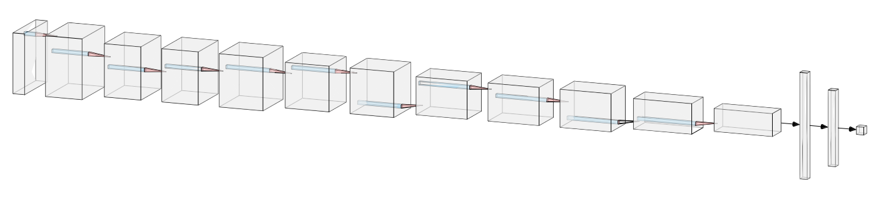
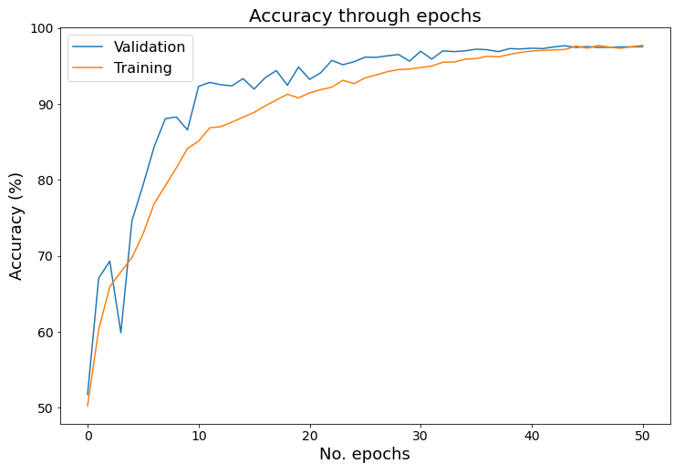
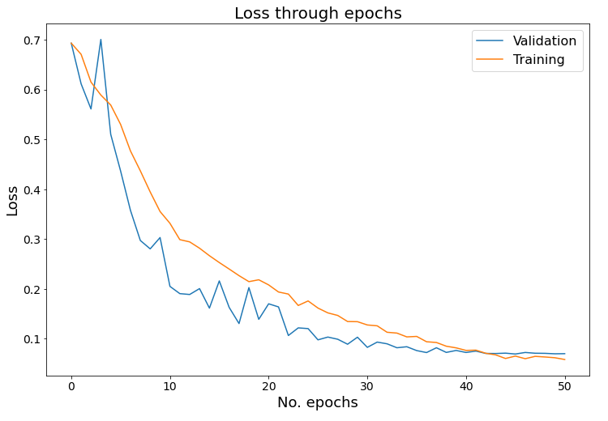
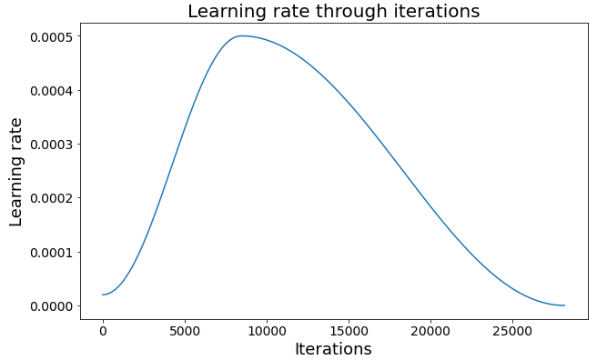
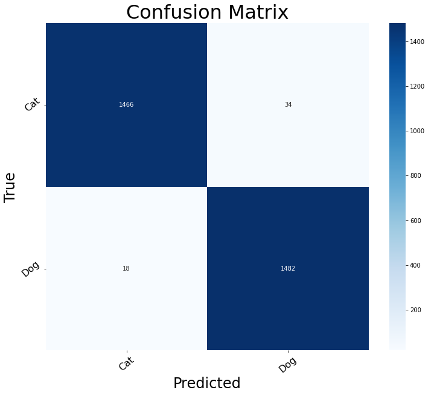

# Cat &amp; dog binary classification with PyTorch

### Accuracy on test set: 98.2667%
 
Used dataset: https://www.kaggle.com/datasets/shaunthesheep/microsoft-catsvsdogs-dataset
 
 
Time of training (with validation phases) 4.0h 15.0m 25s.
 
 

 

 

 

 

 

Confusion matrix was created from the predictions on the TEST set
 
 

Total parameters:   19,913,346 
Total trainable parameters:   19,913,346 
 
Training dataset size: 		17,998 
Validation dataset size: 	4,000 
Test dataset size: 		3,000 
 
Input image size: 256 × 256 
 
Batch size:    	 32 
Learning rate: 	 0.0005 
Loss function: 	 cross_entropy 
No. epochs:    	 50 
 

Epoch: 1 
TRAINING     train accuracy 60.28%, train loss: 0.6706 
VALIDATION   val accuracy   67.05%, val loss:   0.6114 
 
Epoch: 2 
TRAINING     train accuracy 65.92%, train loss: 0.6149 
VALIDATION   val accuracy   69.30%, val loss:   0.5610 
 
Epoch: 3 
TRAINING     train accuracy 67.89%, train loss: 0.5890 
VALIDATION   val accuracy   59.88%, val loss:   0.7005 
 
Epoch: 4 
TRAINING     train accuracy 69.77%, train loss: 0.5689 
VALIDATION   val accuracy   74.62%, val loss:   0.5101 
 
Epoch: 5 
TRAINING     train accuracy 72.88%, train loss: 0.5301 
VALIDATION   val accuracy   79.33%, val loss:   0.4366 
 
Epoch: 6 
TRAINING     train accuracy 76.88%, train loss: 0.4768 
VALIDATION   val accuracy   84.38%, val loss:   0.3576 
 
Epoch: 7 
TRAINING     train accuracy 79.23%, train loss: 0.4369 
VALIDATION   val accuracy   88.05%, val loss:   0.2972 
 
Epoch: 8 
TRAINING     train accuracy 81.59%, train loss: 0.3945 
VALIDATION   val accuracy   88.28%, val loss:   0.2804 
 
Epoch: 9 
TRAINING     train accuracy 84.13%, train loss: 0.3553 
VALIDATION   val accuracy   86.58%, val loss:   0.3031 
 
Epoch: 10 
TRAINING     train accuracy 85.09%, train loss: 0.3317 
VALIDATION   val accuracy   92.30%, val loss:   0.2051 
 
Epoch: 11 
TRAINING     train accuracy 86.85%, train loss: 0.2989 
VALIDATION   val accuracy   92.83%, val loss:   0.1906 
 
Epoch: 12 
TRAINING     train accuracy 87.00%, train loss: 0.2944 
VALIDATION   val accuracy   92.53%, val loss:   0.1889 
 
Epoch: 13 
TRAINING     train accuracy 87.60%, train loss: 0.2817 
VALIDATION   val accuracy   92.38%, val loss:   0.2007 
 
Epoch: 14 
TRAINING     train accuracy 88.25%, train loss: 0.2667 
VALIDATION   val accuracy   93.33%, val loss:   0.1615 
 
Epoch: 15 
TRAINING     train accuracy 88.88%, train loss: 0.2529 
VALIDATION   val accuracy   91.95%, val loss:   0.2161 
 
Epoch: 16 
TRAINING     train accuracy 89.74%, train loss: 0.2399 
VALIDATION   val accuracy   93.45%, val loss:   0.1630 
 
Epoch: 17 
TRAINING     train accuracy 90.50%, train loss: 0.2267 
VALIDATION   val accuracy   94.38%, val loss:   0.1306 
 
Epoch: 18 
TRAINING     train accuracy 91.27%, train loss: 0.2146 
VALIDATION   val accuracy   92.45%, val loss:   0.2027 
 
Epoch: 19 
TRAINING     train accuracy 90.79%, train loss: 0.2184 
VALIDATION   val accuracy   94.85%, val loss:   0.1390 
 
Epoch: 20 
TRAINING     train accuracy 91.44%, train loss: 0.2081 
VALIDATION   val accuracy   93.22%, val loss:   0.1702 
 
Epoch: 21 
TRAINING     train accuracy 91.87%, train loss: 0.1939 
VALIDATION   val accuracy   94.10%, val loss:   0.1640 
 
Epoch: 22 
TRAINING     train accuracy 92.19%, train loss: 0.1897 
VALIDATION   val accuracy   95.72%, val loss:   0.1066 
 
Epoch: 23 
TRAINING     train accuracy 93.11%, train loss: 0.1669 
VALIDATION   val accuracy   95.15%, val loss:   0.1219 
 
Epoch: 24 
TRAINING     train accuracy 92.67%, train loss: 0.1759 
VALIDATION   val accuracy   95.55%, val loss:   0.1205 
 
Epoch: 25 
TRAINING     train accuracy 93.42%, train loss: 0.1616 
VALIDATION   val accuracy   96.15%, val loss:   0.0979 
 
Epoch: 26 
TRAINING     train accuracy 93.80%, train loss: 0.1520 
VALIDATION   val accuracy   96.12%, val loss:   0.1035 
 
Epoch: 27 
TRAINING     train accuracy 94.24%, train loss: 0.1468 
VALIDATION   val accuracy   96.33%, val loss:   0.0991 
 
Epoch: 28 
TRAINING     train accuracy 94.51%, train loss: 0.1346 
VALIDATION   val accuracy   96.50%, val loss:   0.0891 
 
Epoch: 29 
TRAINING     train accuracy 94.58%, train loss: 0.1343 
VALIDATION   val accuracy   95.62%, val loss:   0.1032 
 
Epoch: 30 
TRAINING     train accuracy 94.78%, train loss: 0.1277 
VALIDATION   val accuracy   96.92%, val loss:   0.0828 
 
Epoch: 31 
TRAINING     train accuracy 94.98%, train loss: 0.1260 
VALIDATION   val accuracy   95.90%, val loss:   0.0934 
 
Epoch: 32 
TRAINING     train accuracy 95.48%, train loss: 0.1131 
VALIDATION   val accuracy   96.97%, val loss:   0.0899 
 
Epoch: 33 
TRAINING     train accuracy 95.51%, train loss: 0.1114 
VALIDATION   val accuracy   96.88%, val loss:   0.0820 
 
Epoch: 34 
TRAINING     train accuracy 95.87%, train loss: 0.1038 
VALIDATION   val accuracy   96.97%, val loss:   0.0841 
 
Epoch: 35 
TRAINING     train accuracy 95.96%, train loss: 0.1048 
VALIDATION   val accuracy   97.20%, val loss:   0.0764 
 
Epoch: 36 
TRAINING     train accuracy 96.27%, train loss: 0.0941 
VALIDATION   val accuracy   97.12%, val loss:   0.0724 
 
Epoch: 37 
TRAINING     train accuracy 96.18%, train loss: 0.0926 
VALIDATION   val accuracy   96.88%, val loss:   0.0820 
 
Epoch: 38 
TRAINING     train accuracy 96.51%, train loss: 0.0851 
VALIDATION   val accuracy   97.28%, val loss:   0.0727 
 
Epoch: 39 
TRAINING     train accuracy 96.78%, train loss: 0.0818 
VALIDATION   val accuracy   97.22%, val loss:   0.0766 
 
Epoch: 40 
TRAINING     train accuracy 96.94%, train loss: 0.0767 
VALIDATION   val accuracy   97.33%, val loss:   0.0725 
 
Epoch: 41 
TRAINING     train accuracy 97.04%, train loss: 0.0772 
VALIDATION   val accuracy   97.28%, val loss:   0.0753 
 
Epoch: 42 
TRAINING     train accuracy 97.10%, train loss: 0.0710 
VALIDATION   val accuracy   97.50%, val loss:   0.0706 
 
Epoch: 43 
TRAINING     train accuracy 97.16%, train loss: 0.0678 
VALIDATION   val accuracy   97.65%, val loss:   0.0705 
 
Epoch: 44 
TRAINING     train accuracy 97.62%, train loss: 0.0605 
VALIDATION   val accuracy   97.42%, val loss:   0.0712 
 
Epoch: 45 
TRAINING     train accuracy 97.33%, train loss: 0.0653 
VALIDATION   val accuracy   97.55%, val loss:   0.0695 
 
Epoch: 46 
TRAINING     train accuracy 97.68%, train loss: 0.0601 
VALIDATION   val accuracy   97.42%, val loss:   0.0726 
 
Epoch: 47 
TRAINING     train accuracy 97.47%, train loss: 0.0648 
VALIDATION   val accuracy   97.45%, val loss:   0.0710 
 
Epoch: 48 
TRAINING     train accuracy 97.32%, train loss: 0.0635 
VALIDATION   val accuracy   97.50%, val loss:   0.0708 
 
Epoch: 49 
TRAINING     train accuracy 97.52%, train loss: 0.0620 
VALIDATION   val accuracy   97.50%, val loss:   0.0699 
 
Epoch: 50 
TRAINING     train accuracy 97.71%, train loss: 0.0585 
VALIDATION   val accuracy   97.53%, val loss:   0.0702 
 
 

TIME of training (with validation phases) 4.0h 15.0m 25s.
